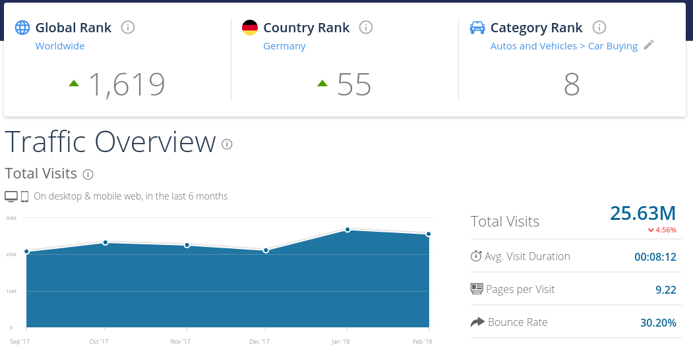

class: center, middle
<!-- background-image: url(images/patrick-tomasso-151382-unsplash.jpg) -->
background-image: url(images/dardan-mu-268794-unsplash.jpg)

# The Continuous Journey from a software developer’s perspective

## Adam Beres-Deak (AutoScout24)

<!-- .photo-credit[ [Photo by Patrick Tomasso](https://unsplash.com/photos/5hvn-2WW6rY) ] -->
.photo-credit[ [photo: Dardan Mu](https://unsplash.com/photos/Jz4tCJMKFLg) ]

---

class: middle

10 million users per month and more than 2.4 million vehicle offers – AutoScout24 is the largest online car marketplace in Europe. With a market presence in 18 countries and more than 55,000 associated dealers, AutoScout24 is represented in all important European markets.

----

<small>
[autoscout24.com](https://www.autoscout24.com) &middot;
[autoscout24.de](https://www.autoscout24.de) &middot;
[autoscout24.at](https://www.autoscout24.at) &middot;
[autoscout24.it](https://www.autoscout24.it) &middot;
[autoscout24.be](https://www.autoscout24.be) &middot;
[autoscout24.fr](https://www.autoscout24.fr) &middot;
[autoscout24.lu](https://www.autoscout24.lu) &middot;
[autoscout24.nl](https://www.autoscout24.nl)  
[autoscout24.es](https://www.autoscout24.es) &middot;
[autoscout24.hu](https://www.autoscout24.hu) &middot;
[autoscout24.pl](https://www.autoscout24.pl) &middot;
[autoscout24.bg](https://www.autoscout24.bg) &middot;
[autoscout24.cz](https://www.autoscout24.cz) &middot;
[autoscout24.ro](https://www.autoscout24.ro) &middot;
[autoscout24.hr](https://www.autoscout24.hr) &middot;
[autoscout24.ru](https://www.autoscout24.ru)  
[autoscout24.se](https://www.autoscout24.se) &middot;
[autoscout24.com.tr](https://www.autoscout24.com.tr) &middot;
[autoscout24.com.ua](https://www.autoscout24.com.ua)
</small>

---

[www.autoscout24.de - traffic estimate by SimilarWeb - Feb 2018](https://www.similarweb.com/website/autoscout24.de)

.center[]

---

class: center, middle, white-headline
background-image: url(images/brina-blum-112501-unsplash.jpg)
.photo-credit[ [photo: Brina Blum](https://unsplash.com/photos/_fBturNUtd8) ]

# Where are we coming from?

---

# Where are we coming from?

Ca. 6 years ago we had
- ... a few monolithic ASP.Net/C# projects
- ... continuous integration pipelines (TeamCity, ~4 stages)
- ... automated unit tests
- ... browser tests
- ... a lot of manual testing
- ... feature toggles
- ... user tracking
- ... from commit to release in under an hour (sometimes)
- ... some projects were released (almost) daily

---

# Where are we now?

---

class: center, white-headline, white-text
background-image: url(images/andrik-langfield-petrides-512923-unsplash.jpg)
.photo-credit[ [photo: ANDRIK LANGFIELD PETRIDES](https://unsplash.com/photos/TyIx-Hyyki0) ]

# In the Cloud

--

* Amazon Web Services

* manged services over self-hosted

* wide range of services (EC2, Lambda, ECS, ELB, ALB, ...)

---
class: center, middle, white-headline, white-text
background-image: url(images/chuttersnap-255215-unsplash.jpg)
.photo-credit[ [photo: chuttersnap](https://unsplash.com/photos/fN603qcEA7g) ]

# Continuous Integration and Deployment

---

class: center, middle

# Continuous Integration and Deployment

- Infrastructure as code
- Master branch based development
- Feature toggling
- Most teams not just do CI but also CD
- Contributions from external teams through Pull Requests

???
- no server re-use / servers are recreated on all deployments
- every commit goes live unless they fail the tests

---

.center[]

---

class: center, middle, white-headline
background-image: url(images/american-public-power-association-430863-unsplash.jpg)
.photo-credit[ [photo: American Public Power Association](https://unsplash.com/photos/AA5v6sMcalY) ]

# Power to the Teams
<!-- # Empowerment -->

---

class: center, middle, white-headline
background-image: url(images/jair-lazaro-480021-unsplash.jpg)
.photo-credit[ [photo: Jair Lázaro](https://unsplash.com/photos/0lrJo37r6Nk) ]

# Monitoring

--

* We use CloudWatch and OpsGenie
* Every team is on-call for their services in rotation

---

# Monitoring - Benefits

* You are more careful 

---

class: center, middle, white-headline
background-image: url(images/denys-argyriou-453348-unsplash.jpg)

# Incidents

.photo-credit[ [photo: Denys Argyriou](https://unsplash.com/photos/VU03qDREAgU) ]

???

- On Call
- Free hunting